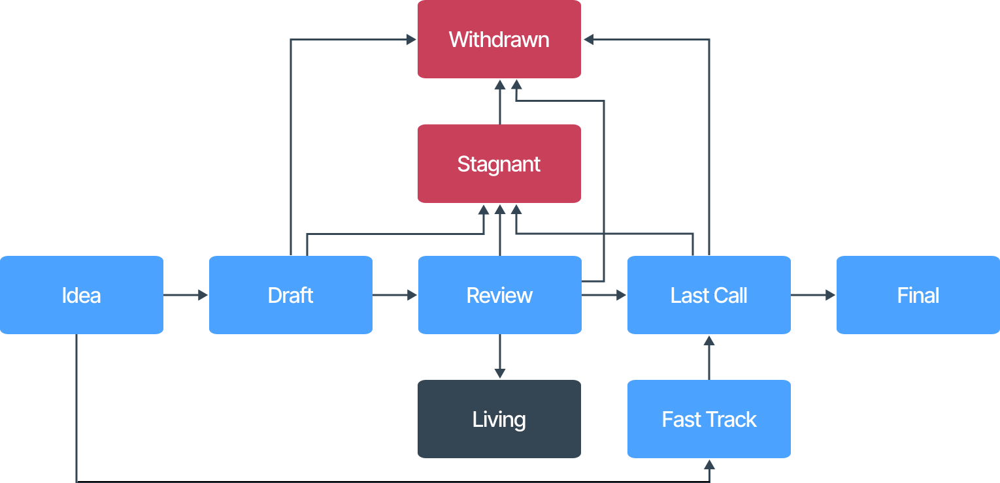

|  SIP-Number | 1 |
|        ---: | :--- |
|       Title | SIP Guidelines |
| Description | A set of guidelines and requirements for the submission and lifecycle of SIPs. |
|      Author | Will Riches \<will@sui.io\> |
|        Type | Process |
|     Created | 2023-05-03 |
|      Status | Living |

## What is SIP?

SIP stands for Sui Improvement Proposal. A SIP is a design document that details a new feature for Sui, its processes, or the ecosystem. It provides the basis for the Sui community to propose a new idea and to assess its merits, its feasability, and the implementation details.

Anybody can create a SIP. However, it is **strongly encouraged** to discuss the potential SIP with the Sui community before creating a proposal. The SIP process is not intended to sort and select the best ideas, but to assess the feasibility of each SIP on its own merit. By seeking feedback from the community before submitting, the author can gauge the extent to which the SIP is needed, and avoid wasting time on unnecessary SIPs.

It is important to understand that the SIP process is decoupled from the actual implementation of the proposal. When a SIP moves into `Final` status, it means that the proposal has been accepted by the community, but it still has to be implemented. The SIP process **does not** track the implementation status.

## SIP type

There are three types of SIP, with procedural differences between each:

1. **Standard**

   A Standard SIP presents a feature which will impact most implementations of Sui, and therefore requires community consensus. These SIPs include consensus changes, networking protocol changes, RPC changes, Sui Move changes, and smart contract standards. Standard SIPs must also specify a [SIP category](#sip-category).

1. **Process**

   A Process SIP presents a change that does not impact the Sui protocol itself, but still requires some level of community consensus. These include developer tooling, node and validator procedures, and changes to the SIP process itself. 

1. **Informational**

   An Informational SIP presents guidelines or information to the community without proposing a specific change or feature. Such SIPs do not result in changes to the Sui protocol or development environment and therefore do not require community consensus for approval.

## SIP category

A SIP category must be specified when the [SIP type](#sip-type) is `Standard`, but not otherwise.

There are five categories of SIP:

1. **Core**: Changes or additions to core features of Sui, including consensus, execution, storage, and account signatures

1. **Networking**: Changes or additions to Sui's mempool or network protocols

1. **Interface**: Changes or additions to RPC specifications or lower-level naming conventions

1. **Framework**: Changes or additions to Sui Move contracts and primitives included within the Sui codebase, such as within the Sui Framework

1. **Application**: Proposals of new Sui Move standards or primitives that would not be included within the Sui codebase but are of significant interest to the developer community

## SIP workflow

Follow the [contribution guidelines](../CONTRIBUTING.md) to submit a SIP. The person who submits a SIP is automatically the [SIP Author](#sip-author). A [SIP Editor](#sip-editor) will be assigned to the SIP and will assess the formatting and structure. If the SIP is correctly formulated:

1. The status will be moved to `Draft` and a SIP number will be assigned. At this point, it has officially entered the SIP process.
1. The SIP Editor will create an official comments thread and update the `Comments-URI` header field to point to this thread.
1. The SIP Editor will guide the SIP Author through the process, including how to gather feedback from all relevant stakeholders. See the [SIP Author](#sip-author) section for more details.

### SIP status

There are eight official statuses for a SIP, although a typical SIP that is approved is only ever expected to go through four stages (`Draft`, `Review`, `Last Call`, and `Final`).

- **Idea**

  This is not an official status, but represents the SIP before it has been assigned a status. At this stage, the SIP Author writes the proposal and submits it as a PR to the SIP repository. If the SIP's formatting and structure do not meet the requirements when it is assessed, it will remain without a status until these issues have been addressed.

- **Draft**

  Once the formatting of the SIP meets the requirements, a SIP Editor will change the status to `Draft` and fill in other necessary fields, including the name of the SIP Editor. The SIP has now formally entered the process.

  At this point, it is the responsibility of the SIP Author to present their proposal to the community. The SIP Editor will help the SIP Author find the appropriate avenues of discussion, which may include forums, community calls, and/or presentations.

  It is also important in the `Draft` stage to consider which stakeholders the SIP will affect, in particular those who would be required to implement it, and to seek their feedback at the earliest stage.

  It is the SIP Author's responsibility to ask the SIP Editor to assess whether the SIP is ready to be moved to `Review` status. The SIP Editor will not actively monitor this progress. There is a time factor involved in making this decision. The more significant and consequential the SIP is, the longer is needed before the SIP is ready to move to `Review`.

- **Review**

  If the SIP Editor is satisfied that comments and feedback from the community and relevant stakeholders have been adequately addressed during the `Draft` stage, the SIP moves into the `Review` stage.

  Once the SIP reaches `Review`, reviewers will be assigned to the PR in order to perform an official review. The SIP Author may request such reviewers, but the SIP Editor is responsible for deciding if they meet the requirements for an official review. A minimum of three reviews are required, with all feedback addressed, for the SIP to proceed to `Last Call`.

  Generally, there is no minimum time period for SIPs to remain in `Review` status, but the SIP Editor may decide to enforce one for a particular SIP. In this case, the minimum time period will be stated when the status is changed to `Review`.

- **Fast Track**

  In some circumstances, a SIP may be moved immediately into `Fast Track` status instead of `Draft`. This is entirely at the SIP Editor's discretion and is reserved for proposals that have already reached community consensus outside of the SIP process.

  Once a SIP reaches `Fast Track` status, the process is the same as the `Review` stage.

- **Last Call**

  Once a SIP has been successfully reviewed and all feedback has been addressed and accepted, the SIP moves into `Last Call`. Typically, this stage lasts a minimum of one week without further comment, but this duration is at the discretion of the SIP Editor and will be clearly stated.

  The purpose of this stage is to give a final chance for dissenting opinions to be aired and to give time for any feedback that has been addressed in the `Review` stage to be digested by all parties.

- **Final**

  The SIP has now been accepted. It is now down to the relevant stakeholders to implement the proposal. Once a SIP has reached `Final` status, it cannot be withdrawn or modified in any way. A further SIP can be submitted to extend or replace features in the original SIP, or the standard could simply stop being used (e.g. for `Application` or `Informational` SIPs).

- **Stagnant**

  A SIP will move into `Stagnant` status if it remains inactive in `Draft`, `Review`, or `Last Call` status for four weeks. Once a SIP reaches `Stagnant` status, it is not usually able to be revived, and instead should be withdrawn and resubmitted as a new SIP. However, in exceptional circumstances, the SIP Editor may bring a Stagnant SIP back to its prior status if requested by the SIP Author.

- **Withdrawn**

  The SIP Author may withdraw their SIP at any stage.

- **Living**

  `Living` is a special status reserved for `Process` SIPs that will never reach `Final` status, such as this SIP.

### SIP author

The SIP Author refers to the person or people that submit the SIP. The SIP Author is responsible for:

- Driving the process forward at all stages
- Bringing the proposal to the attention of the relevant stakeholders, particularly in cases where they will be required to implement the proposal
- Encouraging open debate and discussion
- Addressing and resolving comments and feedback
- Withdrawing a SIP when it is clear that the community cannot reach consensus or it is not feasible to implement

### SIP editor

Although the SIP Author is responsible for driving the SIP, the SIP Editor is available at all stages to support the SIP Author. They can help the SIP Author to understand what is required at each stage, connect with appropriate stakeholders, and open community discussions through the appropriate mediums.

The current register of SIP Editors is as follows:

| Name            | GitHub username | Email address        | Affiliation    |
| :---            | :---            | :---                 | :---           |
| Will Riches     | wriches         | will@sui.io          | Sui Foundation |
| Henry Duong     | hyd628          | henry@sui.io         | Sui Foundation |
| Amogh Gupta     | amogh-sui       | amogh@sui.io         | Sui Foundation |
| Alex Tsiliris   | Eis-D-Z         | alex.tsiliris@sui.io | Sui Foundation |

## SIP comments

Each SIP will have a `Comments-URI` header field set by the SIP Editor when a status is assigned. This location should be used as the primary place for official discussions about the SIP.

## SIP format

The [contribution guidelines](CONTRIBUTING.md) provide a template, which should be used as the basis creating the SIP.

### Header

#### Title

The `Title` field should:

- Follow AP style headline case, which capitalizes most words
- Be no more than 64 characters
- Not end in a period

#### Description

The `Description` field should:

- Be a single, informative sentence
- Be no more than 160 characters

### Linking to other SIPs

Other SIPs may be referenced in the format `SIP-N` where `N` is the number of the SIP being referenced. The first time a SIP is referenced within the document, it must by hyperlinked using a relative Markdown link. Subsequent references may also be linked but this is not required.

### Linking to external resources

External links should not be included, except to the Sui repository.

### Embedding or linking to assets

Assets (including images, code and data) may be embedded into or linked from the Markdown. Such assets should be included within the `assets` directory, in a subdirectory created for the SIP.

## History

This SIP has built on key concepts from both [Bitcoin's BIP-0001](https://github.com/bitcoin/bips/blob/master/bip-0002.mediawiki) and [Ethereum's EIP-1](https://github.com/ethereum/EIPs/blob/master/EIPS/eip-1.md).

## Copyright

[CC0 1.0](../LICENSE.md).
