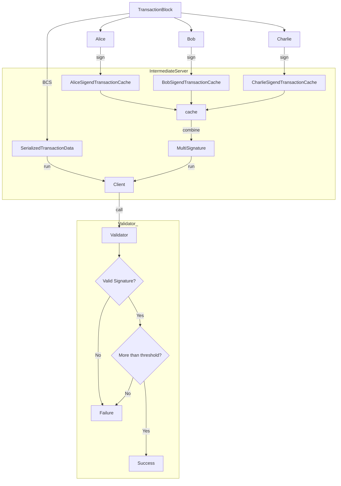
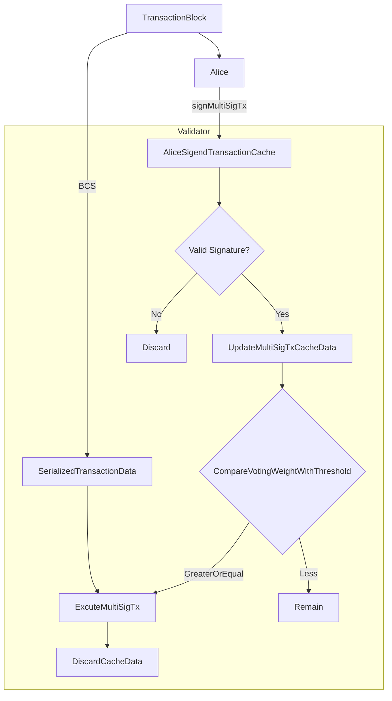
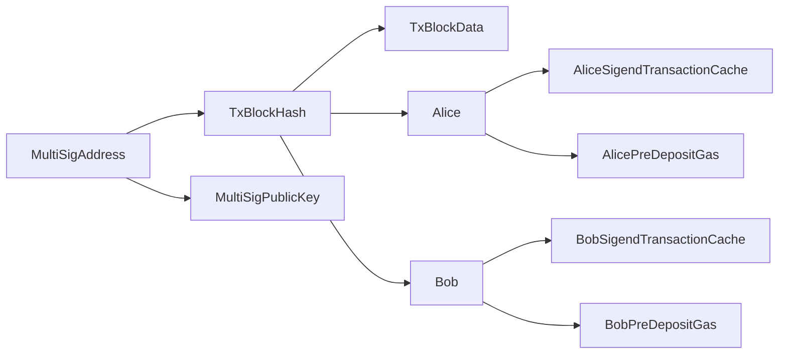

| SIP-Number          | 10 |
| ---:                | :--- |
| Title               | MultiSig Cache Storage |
| Description         | Store cache and combinePartialSignatures in validator nodes for MultiSig.  |
| Author              | Pika <orz@f2cafe.com, @RandyPen> |
| Editor              | Will Riches <will@sui.io, @wriches> |
| Type                | Standard |
| Category            | Core |
| Created             | 2023-08-03 |
| Comments-URI        | https://sips.sui.io/comments-10 |
| Status              | Withdrawn |
| Requires            | |


## Abstract

Adding more support for MultiSig. Making the interaction process smoother.

## Motivation

The current process of using MultiSig in Sui move is quite cumbersome. It requires an intermediary server to cache the signature information of each participant and then merge and send it to the validators.  



If the validators can provide the functionality of caching signature information, merging the signature information based on conditions, and initiating transactions, it can make the entire interaction process smoother.

## Specification

### Validator functionality

Validator nodes validate and cache MultiSig transaction requests. When an account sends a MultiSig transaction request, the validator first verifies the transaction based on the public key of that account. If the transaction is invalid, it is discarded. If it is valid, the validator stores and updates the transaction state based on the MultiSig account address and the hash value of the transaction blockdata as an index. 

During each storage update, the voting weight value of the signed transaction account is checked. If this weight value is greater than the threshold set in the MultiSig account public key, the transaction is executed, and the corresponding cached data for that MultiSig account address is discarded.  



### Economic model

In the above process, Validator nodes provide additional data caching services. Therefore, the account initiating the MultiSig transaction needs to pre-deposit gas fees to pay for the Validator node's data caching service.   
The Validator node charges gas fees based on the time from caching to executing the transaction. After the transaction is executed, the remaining gas fees for each account are returned. If the gas fees pre-deposited for a transaction associated with a MultiSig account are fully consumed, the transaction signing data for that account will be discarded.  

### Explorer And Wallet

The status of MultiSig transactions can be divided into two categories: cached pending transactions and executed transactions.  

When retrieving information for a specific account, it is necessary to retrieve the transaction information for all MultiSig accounts that contain the public key of that account. This information helps analyze which MultiSig transactions are awaiting signature and which ones have already been executed.  


## Rationale

### Validator data caching

In the process of caching pending MultiSig data on validator nodes, a multi-level retrieval is used.



### Pre-deposit gas fee

For pending MultiSig transactions, an account is established for each user who signs the transaction, recording the submission time and pre-deposit gas fee. This is used to calculate the time to retain cached data and the remaining gas fee to be returned to each account after executing the transaction.

### Retrieval of MultiSig transaction data

The public key data format for MultiSig accounts is as follows, which includes the public keys of each participant in the MultiSig account, allowing the derivation of the account address for each participant according to certain rules.

```python
{
    threshold: 3,
    publicKeys: [
        { publicKey: pk1, weight: 1 },
        { publicKey: pk2, weight: 2 },
        { publicKey: pk3, weight: 3 },
    ],
}
```

However, this approach increases the computational load during querying. Alternatively, when generating a MultiSig account, an object containing the non-transferable MultiSig account address can be sent to each participant, thereby improving the efficiency of information retrieval.

## Backwards Compatibility

In addition to the transaction gas fee paid by the MultiSig account during the execution of MultiSig transactions, each participating signing account also needs to pre-deposit gas fees for paying for the caching of transaction signing information.

## Security Considerations

Considering the possibility that different subsets of multi-signature participants may have weights that reach the threshold for the same transaction, leading to the possibility of duplicate transaction execution, it is necessary to be able to retrieve both pending and executed transactions in data retrieval. Users can then check whether the target transaction has already been executed.

## Copyright


