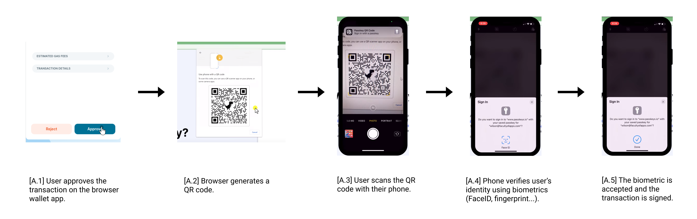
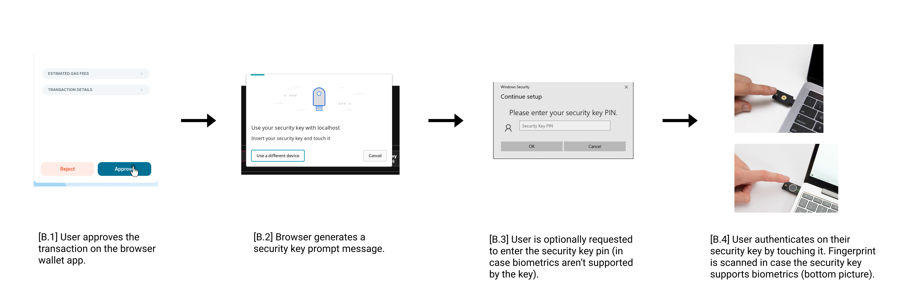
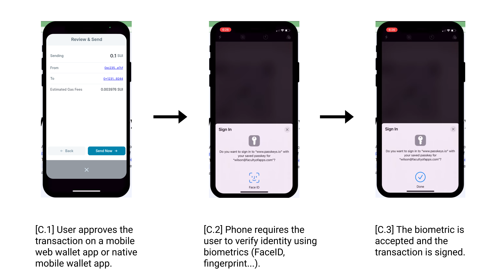

| SIP-Number          | 9 |
| ---:                | :--- |
| Title               | Passkey signature scheme support |
| Description         | This SIP proposes the addition of passkey signature scheme to enable transaction signing using passkey authenticators. |
| Author              | Krešimir Klas <kklas@kunalabs.io, @kklas>, Kostas Chalkias <kostas@mystenlabs.com, @kchalkias>, Joy Wang <joy@mystenlabs.com>, Ben Riva <benriva@mystenlabs.com>, Brandon Williams <brandon@mystenlabs.com>|
| Editor              | Will Riches <will@sui.io, @wriches> |
| Type                | Standard |
| Category            | Core |
| Created             | 2023-08-01 |
| Comments-URI        | https://sips.sui.io/comments-9 |
| Status              | Final |
| Requires            | |

## Abstract

This SIP proposes the addition of a passkey signature scheme to make it possible to sign transactions using passkeys. While the `secp256r1` signature scheme, which is widely used by all passkey authenticators including Yubikeys, Android phones, iPhones, and MacBooks, is available on Sui, the WebAuthn standard doesn't allow for arbitrary message signing and the signed payload includes additional data which makes it incompatible with the `secp256r1` signature scheme on Sui. Therefore, in order to be able to verify transaction signatures produced by the passkey authenticators, a new signature scheme needs to be introduced that can verify signatures of this format.

## Motivation

Passkey signature support would make Sui more accessible to non-advanced users as it can simplify key management and allows for web2-like flows that users are already familiar with.

### WebAuthn and passkey overview

WebAuthn is a W3C standard for passwordless authentication that is supported by all major browsers and operating systems. It is also supported by many hardware devices including Yubikeys, Android phones, and iPhones.

On a high level it works as follows. A digital credential based on public key cryptography (also known as passkey) is created during the registration process and stored on the authenticator (e.g., security key, phone, laptop...). After registration, the authenticator can be used to authenticate the user by signing a challenge provided by the server. Passkeys are often synchronized between user's devices from the same ecosystem using the cloud (with e2e encryption). This makes it possible to use the same passkey on multiple devices and to recover the passkey in case the devices are lost. However, passkeys can also be confined to a single device such as a physical security key.

Passkeys are secure and privacy-preserving. For every registration, a new passkey is created on the authenticator which is tied to and only accessible by the origin (app, website...) that initiated the registration. This prevents the origin from tracking the user across different websites and apps. Passkeys are discoverable which means it's possible for the origin to make an authentication request without knowing any identifiers beforehand. This allows for password-less, username-less authentication flows. Passkey prevents phishing by requiring the authenticator to be in physical proximity to the device where the authentication is initiated. Authenticators that are part of the client device are referred to as *platform authenticators*, while those that are reachable via cross-platform transport protocols ("usb", "nfc", and "ble") are referred to as *roaming authenticators*.

The wide variety of usage modalities and form factors of passkey authenticators makes it possible to design authentication flows that are both secure and convenient for the user. For example, a user can use a passkey stored on their phone to authenticate on a desktop browser by scanning a QR code produced by the browser. The QR code contains BLE pairing information that allows the phone to communicate with the browser over a secure channel and sign the authentication challenge. The BLE pairing is done seamlessly in the background without the user having to manually pair the devices. A video demonstration of this flow can be found [here](https://youtu.be/7UI1T-CwJN8?t=19) and a website to try it out can be found [here](https://webauthn.io/).

### Passkey for Sui

Wallets and key management are a major usability hurdle and an obstacle for mainstream adoption of crypto. By enabling the passkey authenticator for Sui, the key management can be simplified. With passkey, users don't have to manually manage and secure their private keys or seed phrases. Instead, they can use a passkey that is securely stored on their device to sign transactions. This offers two major advantages: 

1. The private key material does not leave the enclave or device during signing. 
2. The passkey private key is always scoped to its relying party. A different origin cannot ask the passkey to sign something that scoped to a different origin. 

If the device is cloud-enabled, the passkey can be synchronized between the user's devices. This makes it possible to use the same address on multiple devices without having to manually import the private key or seed phrase which is prone to phishing attacks and key leaks. It also makes it possible to recover the passkey in case the device is lost.

In the user doesn't fully trust the cloud with key management, one could, for example, employ a multisig address with 2 of 4 threshold such that:
- the cloud-synced passkey on a phone has weight 1
- a security key (e.g., Yubikey) passkey has weight 1
- a hardware wallet has weight 2

In this case, the seamless user experience is preserved as the transactions can be easily signed using the phone passkey and the security key (either over usb or nfc) together, while at the same time the cloud-synced passkey doesn't have to be fully trusted as it can't sign transactions on its own. And in case either the security key, phone, or the hardware wallet is lost, the address can be recovered by using the remaining 2 devices.

In conclusion, the motivation for integrating passkey into Sui is multifold. It offers an opportunity to address key pain points in the current user experience, namely the complexities associated with key management. By simplifying these processes, passkey can drastically enhance the user experience and, ultimately, help drive the mainstream adoption of Sui. This ultimately demonstrates how the integration of passkey can make Sui not just more secure, but more accessible.

### Example flows

This section describes a few relevant (out of multitudes possible) transaction signing flows enabled by passkey. Since passkey is widely supported by all of the major platforms (including Windows, Android, iOS, and macOS), the user is *not* required to install any additional software, apps, browser extensions, or middleware for the flows described here.

#### Flow (A) - desktop browser + phone cross-platform authentication

This flow describes how a user can use a passkey stored on their phone to sign a transaction initiated on a desktop browser. The passkey is protected by a PIN or biometrics and is securely stored on the phone. Additionally, the passkey is securely backed up on the cloud and can be synchronized between the user's devices.

The figure below describes the flow. A transaction is initiated by a web3 app which opens a pop-up window of the wallet browser extension. When the user reviews and approves the transaction (fig. A.1), the browser creates a pop-up window with a QR code (fig. A.2). The user then scans the QR code with their phone (fig. A.3). The phone will then require the user to authenticate using a pin or biometrics (fig. A.4). When the user authenticates, the transaction will be signed by the passkey and the signature passed over to the desktop browser (A.5). The wallet app running in the browser will then broadcast the transaction to the blockchain.



#### Flow (B) - desktop browser + security key cross-platform authentication

This flow describes how a user can use a security key (e.g., Yubikey) to sign a transaction initiated on a desktop browser. The passkey is stored on the security key and is protected by a PIN or biometrics. Once the passkey is generated on the security key, it can never leave the device and it's not possible to back it up. It's advised to only use this method in a multisig setup where the security key is only one of the possible signers because if the security key is lost the account can't be recovered.

The figure below describes the flow. A transaction is initiated by a web3 app which opens a pop-up window of the wallet browser extension. When the user reviews and approves the transaction (fig. B.1), the browser creates a pop-up prompting the user to authenticate using their security key (fig. B.2). In case the security key doesn't support biometrics, the user will be required to enter their PIN (fig. B.3). The user then authenticates by touching the security key (fig. B.4), and in case the security key supports biometrics, the user's fingerprint is scanned. The transaction will then be signed by the passkey stored on the security key and the signature passed over to the desktop browser. The wallet app running in the browser will then broadcast the transaction to the blockchain.



#### Flow (C) - platform authentication

This flow describes how a user can use a passkey to sign a transaction initiated on the same device. This flow is similar to flow (A) but without the intermediate step of scanning the QR code. It is possible on platforms that natively support passkey management (e.g., Android, iOS, macOS, Windows).

The figure below describes how a user would use their phone to sign a transaction initiated in an app on the same phone. A transaction is initiated by a mobile app which opens a transaction confirmation dialog. When the user reviews and approves the transaction (fig. C.1), the phone creates a pop-up window requiring the user to authenticate using a pin or biometrics (fig. C.2). When the user authenticates, the transaction will be signed by the passkey and the signature passed over back to the app (C.3). The app will then broadcast the transaction to the blockchain.



## Specification

A new `passkey` signature scheme is introduced that allows clients to construct transaction signatures using passkey authenticators. Although the passkey supports multiple signature algorithms, only the `secp256r1` algorithm is allowed by Sui.

### Signature encoding

`passkey` signatures are serialized with the following `BCS` structure and prepended with a flag for passkey authenticator `0x06`:

```typescript
    // type defined as each field as a vector
    bcs.registerStructType('PasskeyAuthenticator', {
        authenticatorData: [BCS.VECTOR, BCS.U8],
        clientDataJson: [BCS.VECTOR, BCS.U8],
        userSignature: [BCS.VECTOR, BCS.U8],
    })
  
    // encodes the struct in bcs and prepend with a flag 0x06
    export function encodePasskeySignature(
        authenticatorData: Uint8Array,
        clientDataJSON: Uint8Array,
        sig: Uint8Array,
    ) {
        let bytes = bcs
        .ser('PasskeyAuthenticator', {
            authenticatorData: authenticatorData,
            clientDataJson: clientDataJSON,
            userSignature: sig,
        })
        .toBytes();

        const sigBytes = new Uint8Array(1 + bytes.length);
        sigBytes.set([0x06]);
        sigBytes.set(bytes, 1);
        return sigBytes;
    }
```

`PasskeyAuthenticator` is defined as one of `GenericSiganture` thanks to [crypto agility](https://mystenlabs.com/blog/cryptography-in-sui-agility). A flag byte is defined during serialization indicating the signature scheme. This is set to `0x06` for `PasskeyAuthenticator`. Once deserialized as a passkey authenticator, the verification logic is executed as described in the next section. 

`authenticatorData` is a byte array that encodes [Authenticator Data](https://www.w3.org/TR/webauthn-2/#sctn-authenticator-data) structure returned by the authenticator attestation response as is (byte array of 37 bytes or more). Its contents are not relevant here but it's required for signature verification.

`clientDataJson` is a byte array that is a JSON-compatible UTF-8 encoded serialization of the client data which is passed to the authenticator by the client during the authentication request (see [CollectedClientData](https://www.w3.org/TR/webauthn-2/#dictdef-collectedclientdata)). It contains (among other fields) the `challenge` field which is the `base64url` URL encoded `intent || blake2b_hash(tx_data)` that was passed in by the client to the authenticator. This field needs to be parsed in order to verify that the signature has been produced over 35-byte digest encoded as `intent || blake2b_hash(tx_data)` where `blake2b_hash(tx_data)` is also known as the transaction digest.

`signature` is a byte array that encodes `flag || sig_bytes || pk_bytes`. The `flag` indicates the flag (currently it is required to be `secp256r1`'s signature scheme `0x02`). Both the signature and public key should be converted from DER format in passkey authenticator response to the compact format and with the requirements specified below:

- `sig_bytes` is the signature bytes produced by the authenticator. It is 64 bytes long and is encoded as a simple concatenation of two octet strings `r || s` where `r` and `s` are 32-byte big-endian integers. The signature must have its `s` in the lower half of the curve order. If s is too high, it is required to convert `s` to `order - s` where curve order is `0xFFFFFFFF00000000FFFFFFFFFFFFFFFFBCE6FAADA7179E84F3B9CAC2FC632551` defined [here](https://secg.org/SEC2-Ver-1.0.pdf). 

- `pk_bytes` is the public key bytes in compacted format as 33 bytes. This is derived from the public key returned from passkey registration.

### Signature verification

The signature verification is performed by the Sui validators using the following algorithm. This is implemented as a Sui protocol change with `trait AuthenticatorTrait`. 

1. Check the `flag` byte as `0x06`, then deserialize it as `PasskeyAuthenticator`.
2. Validate the `clientDataJSON` to be well formed. That is, it can be deserialized with struct [`CollectedClientData`](https://github.com/1Password/passkey-rs/blob/main/passkey-types/src/webauthn/attestation.rs#L581) with required fields such as `type`, `origin`, `crossOrigin`, `challenge` and allows for arbitrary additional fields. The `type` field must be `webauthn.get`, and the `challenge` must be decoded successfully with `base64url` into a 35-byte digest. If not, reject the signature.
3. Verify that the `challenge` field equals to the digest `intent || blake2b_hash(tx_data)` derived from the transaction. If not, reject the signature.
4. Verify the sender of the transaction is derived correctly as `blake2b_hash(flag_passkey || pk_passkey)`. If not, reject the signature.
5. If the `flag` in `user_signature` is not `secp256r1`, reject the signature. 
6. Verify the signature and public key with the secp256r1 ECDSA algorithm using the constructed message as `authenticatorData || sha256(clientDataJSON)`. If verification fails, reject the signature.

### Passkey wallet creation

The public key is returned to frontend upon credential creation (`navigator.credentials.create`). A passkey address is defined as `blake2b_hash(flag_passkey || pk_passkey)` where the flag is `0x06`.

### Transaction signing using Passkey

To sign a transaction using passkey, the client needs to make an [`assertion`](https://www.w3.org/TR/webauthn-2/#authenticatorgetassertion) request to the authenticator where the [`challenge`](https://www.w3.org/TR/webauthn-2/#dom-publickeycredentialrequestoptions-challenge) is set to the 35-byte digest `intent || blake2b_hash(tx_data)`.

The signature is required to be encoded as described above using the passkey assertion response when submitting to Sui for transaction execution. 

## Rationale

1. Why select `Secp256r1` for passkey creation? While passkey supports multiple different signature schemes, including `ed25519`, only the `secp256r1` scheme has wide support across different authenticators with other schemes having limited support on some security keys. In addition, `secp256r1` supports recovering public key from signature. This is an important feature to allow addresses to be re-derived on a new device or as part of the wallet recovery flow (discussed in details in next section).

2. Why can't the `Secp256r1` signature scheme be reused but another `passkey` scheme is necessary? The `secp256r1` scheme on Sui requires that the signature is produced over `blake2b_hash(intent || tx_data)` instead of `authenticatorData || sha256(clientDataJSON)` where `clientDataJSON` contains the challenge as `intent || blake2b_hash(tx_data)`. This is incompatible with the signatures produced by passkey authenticators since the verification requires additional data in the signature payload. Therefore, a new signature scheme needs to be introduced that can verify signatures produced by passkey authenticators.

3. Why do we need `authenticatorData` and `clientDataJson` as part of the signature? This is because the signature is produced over `authenticatorData || sha256(clientDataJSON)`, `authenticatorData` and `clientDataJSON` also need to be included in the signature payload. Furthermore, it is not possible to send only `sha256(clientDataJSON)` because `clientDataJSON` needs to be parsed in order to verify that it contains the correct `challenge`.

4. Why the challenge is set to `intent || blake2b_hash(tx_data)`? This is to make sure the signature is committed over the correct transaction and its intent. 

5. Why is it required to pass the entire `clientDataJSON` payload if only 4 fields (`type`, `challenge`, `origin`, and `crossOrigin`) are mandatory? This is because the JSON encodings are not canonical, and even though the `clientDataJSON` encoding algorithm is more strictly defined, it is still possible for the client to send in a different encoding. Furthermore, the WebAuthn specification [notes](https://www.w3.org/TR/webauthn-2/#dictionary-client-data) that "it's critical when parsing to be tolerant of unknown keys and of any reordering of the keys". So in order to avoid any potential compatibility issues in the future, it is better to send the `clientDataJSON` as is.

### Public key recovery

One of the inconveniences of using the WebAuthn standard for this use case is that the public key for the passkey is only returned to the client upon registration but not during signing.

Therefore, it is recommended for wallets to persist the public key as a state. During recovery flow or registering a new device, the client can make a regular WebAuthn assertion request to get a signature and the client can recover the public key and the passkey Sui address. Since `ECDSA` public key recovery can produce up to 4 valid public keys for a signature, two assertion requests are required to determine the only one possible public key by comparing the two sets of recovered public keys. 

## Backwards Compatibility

The signature scheme is enabled under the domain separated flag 0x06. There are no issues with backwards compatibility with other signature schemes. 

## Reference Implementation

There is a proof of concept implementation in TypeScript that demonstrates transaction [signing](https://github.com/kunalabs-io/sui-webauthn-poc/blob/master/src/index.ts#L158-L181), [encoding](https://github.com/kunalabs-io/sui-webauthn-poc/blob/master/src/index.ts#L183), [decoding](https://github.com/kunalabs-io/sui-webauthn-poc/blob/master/src/index.ts#L184), [verification](https://github.com/kunalabs-io/sui-webauthn-poc/blob/master/src/index.ts#L189), and public key [recovery](https://github.com/kunalabs-io/sui-webauthn-poc/blob/master/src/index.ts#L204-L252) with WebAuthn as described in this SIP. It can be found here https://github.com/kunalabs-io/sui-webauthn-poc.

Forked repo with implementation for Sui transaction construction and signing in [frontend](https://github.com/joyqvq/sui-webauthn-poc) against localnet ran against this [PR](https://github.com/MystenLabs/sui/pull/18126).

## Security Considerations

The origin which a passkey is attached to needs to be carefully considered. Since any process or extension that has access to the origin can initiate a passkey assertion request, the origin always needs to be in a trusted sandbox environment such as a stand alone application, browser wallet extension, or mobile app. If the passkey is tied to an origin that is not in a trusted environment it can be susceptible to wallet impersonation attacks.

## Copyright

[CC0 1.0](../LICENSE.md).