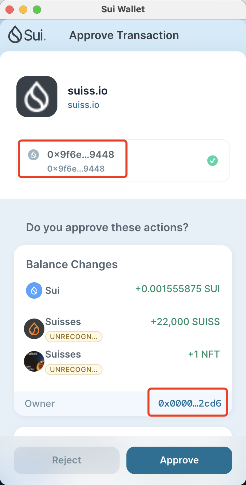
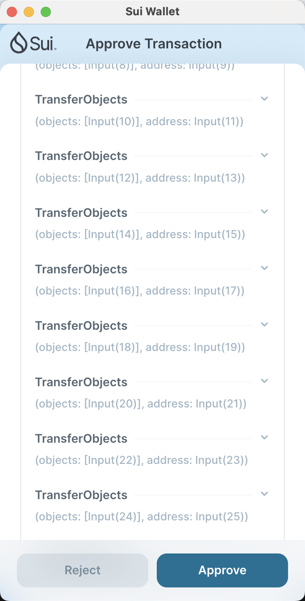
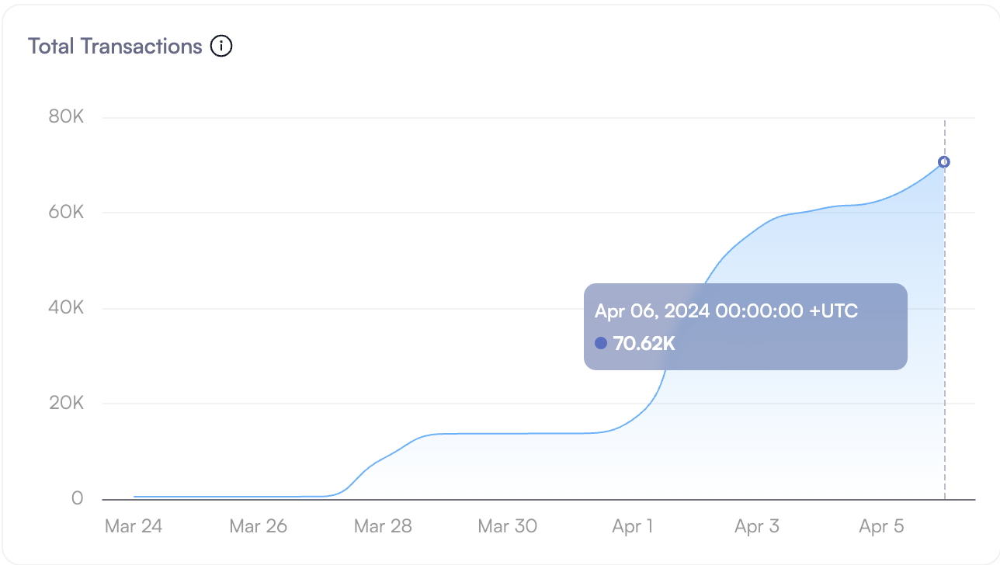

| SIP-Number          | <Leave this blank; it will be assigned by a SIP Editor> |
| ---:                | :--- |
| Title               | DryRunTransactionBlockResponse Reorder  |
| Description         | Reorganize the information in the DryRunTransactionBlockResponse to provide a clearer view of how the transaction impacts the user's account. |
| Author              | Pika <pika042@hotmail.com> |
| Editor              | <Leave this blank; it will be assigned by a SIP Editor>  |
| Type                | Informational |
| Category            | Application |
| Created             | 2024-05-14 |
| Comments-URI        | <Leave this blank; it will be assigned by a SIP Editor> |
| Status              | <Leave this blank; it will be assigned by a SIP Editor> |
| Requires            | <Optional; SIP number(s), comma separated> |

## Abstract

Currently, Sui offers a valuable feature called `DryRunTransactionBlock`, which allows users to preview the changes in their assets before and after a transaction, assisting them in making informed decisions and reducing risks. However, the information in the `DryRunTransactionBlockResponse` is not well-organized, making users susceptible to potential attacks. By reorganizing the information in the `DryRunTransactionBlockResponse`, we can help users more directly observe the impact of transactions on their accounts.

## Motivation

Reviewing a classic hacking case, where a simulated transaction is triggered upon the user's initiation of a transaction, allowing for a preview of the transaction's effects within the wallet. 

  

Careless users, upon seeing an increase in assets, may hastily authorize a transaction without hesitation. However, a simple scroll down would reveal that a significant portion of their assets would be transferred away in this transaction.

 

 

 

[Historical statistical data on the hacking incidents involving this package](https://suivision.xyz/package/0xd89d1288e1d0a69cc7e5a30625c238e2310e4c23221557b819174f8c14b31ef8?tab=Statistics).

The current `DryRunTransactionBlockResponse` information is not sufficiently intuitive for users, potentially leaving careless users unable to recognize hackers' traps. This SIP aims to enhance the security of user assets by reorganizing the `DryRunTransactionBlockResponse` data to make it more intuitive and easily comprehensible.

## Specification

The original arrangement of the data structure in the `DryRunTransactionBlockResponse`.  

```typescript
export interface DryRunTransactionBlockResponse {
	balanceChanges: BalanceChange[];
	effects: TransactionEffects;
	events: SuiEvent[];
	input: TransactionBlockData;
	objectChanges: SuiObjectChange[];
}
```

The revised arrangement will sort the `balanceChanges` and `objectChanges` by account address, prioritizing the changes to the sender's account, followed by those of other users, and lastly, the changes to the shared object, as the information regarding shared object changes is less intuitive. When presenting account changes, reductions will be listed before increases.

Priority of information arrangement  
- accountChanges: 
  - senderAccountChanges
    - senderAccountBalanceReduction
    - senderAccountBalanceIncrease
    - senderAccountObjectReduction
    - senderAccountObjectIncrease
  - otherAccountChanges
    - otherAccountBalanceReduction
    - otherAccountBalanceIncrease
    - otherAccountObjectReduction
    - otherAccountObjectIncrease
  - Shared Object Changes

## Rationale

This SIP, taking into account hacking scenarios and from a human factors engineering perspective, has re-engineered the data interface to effectively assist users in avoiding attacks.

## Backwards Compatibility

Currently, the `DryRunTransactionBlockResponse` is returned in JSON format, and processing it would require adjustments to subsequent interface stages. While individual wallet applications could parse and rearrange the data from the `DryRunTransactionBlockResponse`, optimizing the data interface uniformly would better ensure a consistent and enhanced user experience across all platforms.

## Reference Implementation

[example code](https://github.com/RandyPen/DryRunTransactionBlockResponsePlus).  

## Security Considerations

This SIP has undertaken a redesign of the interface from a human factors engineering perspective, which can enhance the user's experience with regard to security.

## Copyright

[CC0 1.0](../LICENSE.md).
