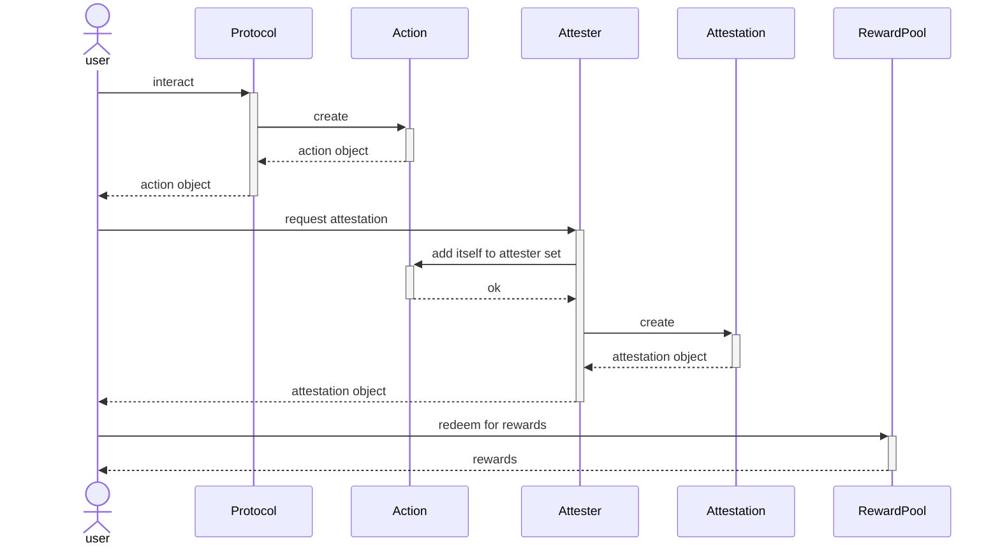
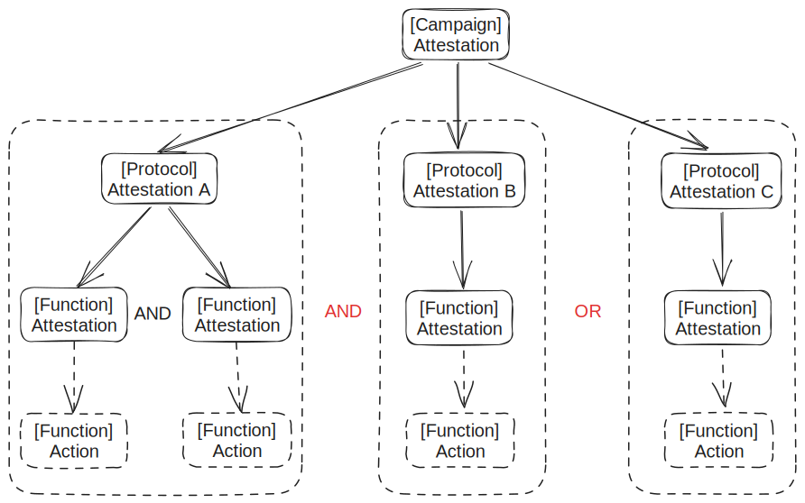

|   SIP-Number | 11                                                                                                                     |
|-------------:|:-----------------------------------------------------------------------------------------------------------------------|
|        Title | Action Primitive                                                                                                       |
|  Description | Introduction of object types Action and Action Attestation to enable interoperability around users' on-chain behaviors |
|       Author | Patrick <patrick@cubicgames.xyz, stone@cubicgames.xyz, panda@cubicgames.xyz>                                           |
|       Editor | Will Riches <will@sui.io, @wriches>                                                                                    |
|         Type | Standard                                                                                                               |
|     Category | Application                                                                                                            |
|      Created | 2023-09-19                                                                                                             |
| Comments-URI | https://github.com/sui-foundation/sips/pull/11                                                                         |
|       Status | Withdrawn                                                                                                              |
|     Requires |                                                                                                                        |

## Abstract

Lying at the core of Action Primitive, an action object describes an interaction from a user with a Sui module with attributes detailing what happens stored in a `bag` data structure (to support heterogeneous values), which exhibits **mixed properties of Event and Non-fungible Token**.

In this SIP we also introduce `Action Attestation`, the first extension built upon Action Primitive, to showcase how to utilize interoperability enabled by the new primitive.

Overall, we envision Action Primitive as an important differentiator against EVM-based ecosystems thanks to the object-native design rooted in Sui Move.

## Motivation

### Interaction as an object

Traditionally in smart contract development, to keep users' on-chain behaviors in check, it's required for contracts to emit events for off-chain observers to consume. Doing so forfeits the on-chain nature of these behaviors due to lack of interoperability.

On the other spectrum, Action Primitive introduces a new programming paradigm: wherever an event is emitted, an equivalent action object can be created as a supplement (or replacement in some cases). This new paradigm essentially makes every interaction happening on chain an interoperable object, allowing novel use cases to be built upon it.

### Programmable data asset

From another perspective, action objects are essentially data assets accumulating on chain in real-time, but fully programmable.

Actions record account owners' on-chain footprints, either day-to-day interactions with DeFi applications or achievements in their on-chain life. On the premise of broad adoption of action primitive, it's even possible to portrait any user's on-chain identity by simply aggregating action objects owned by them. These action objects can be processed to fit different analysis needs, such as filtering by desired time range or sorting in chronological order.

Programmability expands the value of this class of data asset further. For instance, actions can opt into `display` primitive to be sensible to end users in an artistic form, or have different extensions built upon interoperate with it. The first of such extensions will be `Action Attestation` introduced in the following sections.

## Specification

Four entities are introduced in this SIP, `Action`, `Action Attestation`, `Action Attester`, and `Reward Pool`. The sequence diagram below depicts the interactions among them:
1. A user initiates transaction with some protocol that integrates Action Primitive
2. The protocol creates an `Action` object and transfers it to the user
3. The user requests attestation from some whitelisted `Attester`
4. The `Attester` tries to add itself to the attester set associated with the action object first, which would revert if it has existed
5. The `Attester` creates an `Attestation` object and transfers it to the user
6. The user redeems the `Attestation` object for eligible rewards with `RewardPool`



### Action

An `Action` object describes an interaction from a user with a Sui module associated with attributes detailing what happens.

`struct Action` embeds following fields:
- `attributes`: to store attributes describing an action in a `Bag` container to support heterogeneous values
- `attested_by`: to store all previous attesters to avoid double attestation

``` rust
/// Action<T> is bound to a witness type of some other Sui module, which represents interactions with that specific module
struct Action<phantom T: drop> has key, store {
    id: UID,
    attributes: Bag,
    attested_by: VecSet<TypeName>,
}

/// Creates a empty Action<T> object
public fun new<T: drop>(_witness: T, ctx: &mut TxContext): Action<T>

/// Add attester to the attester set associated with the action object
public fun add_attester<T: drop, ATTESTER: drop>(_witness: ATTESTER, act: &mut Action<T>)

/// Check if specified ATTESTER has attested given action object
public fun is_attested<T: drop, ATTESTER: drop>(act: &Action<T>): bool

/// Get attribute value associated with the given key
public fun get_attr<T: drop, V: copy + drop + store>(act: &Action<T>, k: vector<u8>): V

/// Add attribute to the action
public fun add_attr<T: drop, V: copy + drop + store>(_witness: T, act: &mut Action<T>, k: vector<u8>, v: V)

/// Remove attribute from the action
public fun remove_attr<T: drop, V: copy + drop + store>(_witness: T, act: &mut Action<T>, k: vector<u8>): V
```

### Action Attestation

Objects of type `Action Attestation` are issued to users meeting criterion set by an attester module.

`struct ActionAttestation` embeds following fields:
- `attestee`: attested action object ID
- `attributes (dynamic fields)`: metadata describing the attestation which may be used in reward calculation and distribution
- `children (dynamic object fields)`: to encode hierarchical relationship among attestations

Since the process of attestation composition is designed to be irreversible, dynamic object field is favored over `dof` based collections to store `children` of an attestation object in that they can be dropped directly on object destruction. The same goes for `attributes` field.

``` rust
/// ActionAttestation<T> is bound to a witness type of some attester module
/// An attestation object may embed some attributes and children in dynamic fields
struct ActionAttestation<phantom T: drop> has key, store {
    id: UID,
    attestee: vector<u8>
}

/// Create an empty ActionAttestation<T> object attesting an action with type Action<U>
public fun new<T: drop, U: drop>(_witness: T, action: &Action<U>, ctx: &mut TxContext): ActionAttestation<T>

/// Destroy an ActionAttestation<T> object
public fun destroy<T: drop>(val: ActionAttestation<T>)

/// Get ID of the attested action
public fun get_attestee<T: drop>(att: &ActionAttestation<T>): &vector<u8>

/// Get attribute value associated with the given key
public fun get_attr<T: drop, V: copy + drop + store>(att: &ActionAttestation<T>, k: vector<u8>): V

/// Add attribute to the attestation
public fun add_attr<T: drop, V: copy + drop + store>(_witness: T, att: &mut ActionAttestation<T>, k: vector<u8>, v: V)

/// Remove attribute from the attestation
public fun remove_attr<T: drop, V: copy + drop + store>(_witness: T, att: &mut ActionAttestation<T>, k: vector<u8>): V

/// Add children to an attestation object as dof to establish hierarchy
public fun add_children<T: drop, U: drop>(root: &mut ActionAttestation<T>, children: vector<ActionAttestation<U>>)
```

**Attester Example**

The following attester module issues attestations on the condition that the weight field of the given `Action<VotingProto>` object is greater or equal to 10.

``` rust
#[test_only]
module sap::voting_action_attester {
  use sap::action::{Self, Action};
  use sap::action_attestation::{Self, ActionAttestation};
  use sui::tx_context::{sender, TxContext};
  use sui::transfer;

  const EActionIneligible: u64 = 1;

  struct Attester has drop {}

  public fun attest<T: drop>(action: &mut Action<T>, ctx: &mut TxContext): ActionAttestation<Attester> {
    action::add_attester<T, Attester>(Attester{}, action);
    let weight = action::get_attr<T, u64>(action, b"weight");
    assert!(weight >= 10, EActionIneligible);
    let att = action_attestation::new<Attester, T>(Attester{}, action, ctx);
    action_attestation::add_attr<Attester, u64>(Attester{}, &mut att, b"weight", weight / 10);
    att
  }

  public entry fun attest_and_take<T: drop>(action: &mut Action<T>, ctx: &mut TxContext) {
    let attestation = attest<T>(action, ctx);
    transfer::public_transfer(attestation, sender(ctx));
  }
}
```

### ProRataRewardPool

A reward pool is the entity that handles attestation whitelisting, reward calculation and distribution. Witness types bound to `Action Attestation` should be whitelisted to be eligible for the reward redemption. During redemption process, users burn objects of type `Action Attestation` and enroll associated attributes to be included in the reward distribution.

`ProRataRewardPool` mimics reward model used by *Bullshark Quests* in which fixed amount of rewards are shared by eligible participants pro rata.

``` rust
struct RewardPool<phantom T> has key {
    id: UID,
    whitelisted_attesters: VecSet<TypeName>,
    vault: Coin<T>,
    allocations: VecMap<address, u64>,
    total_alloc: u64,
    ended: bool
}

struct RewardPoolAdminCap has key {
    id: UID,
    pool_id: ID,
}

/// Create a reward pool as shared object and transfer accompanying RewardPoolAdminCap object to the sender
public entry fun create<T>(ctx: &mut TxContext)

/// Instantiate a reward pool and make it a shared object
/// A RewardPoolAdminCap object is created in the meantime to guard priviledged functions
public fun new<T>(ctx: &mut TxContext): (RewardPoolAdminCap)

/// Whitelist a witness type of some atteser module
public entry fun whitelist_attester<T, ATTESTER: drop>(cap: &RewardPoolAdminCap, pool: &mut RewardPool<T>)

/// Burn attestation object of type Attestation<ATTESTER> and register its associated metadata
public entry fun enroll_with_attestation<T, ATTESTER: drop>(pool: &mut RewardPool<T>, att: ActionAttestation<ATTESTER>, ctx: &mut TxContext)

/// Anyone can fund a reward pool
public entry fun fund<T>(pool: &mut RewardPool<T>, coins: vector<Coin<T>>)

/// Conclude a reward pool
public entry fun conclude<T>(cap: &RewardPoolAdminCap, pool: &mut RewardPool<T>)

/// Claim rewards pro-rata to weight of the previously enrolled attestation
public fun claim<T>(pool: &mut RewardPool<T>, ctx: &mut TxContext): Coin<T> 

/// Claim and take rewards
public entry fun claim_and_take<T>(pool: &mut RewardPool<T>, ctx: &mut TxContext)
```

## Rationale

During a promotional campaign, different reward pools will usually get set up to incentive certain types of interactions. The extension of `Action Attestion` is introduced to standardize such incentive schemes.

The reasoning behind the decoupling design of `Action` and `Action Attestation` is as follows.

### Lifecycle Discrepancy

Actions may be performed due to incentives, but should span across any incentive campaign to eternity considering their existence as permanent records around an account address. On the other hand, objects of `Attestation` serve more as one-time certificates to enable redemption of rewards in a campaign and should be burned atomically.

### Single Responsibility Principal

The integration of action primitive to existing or future business modules should be as seamless as possible. By isolating eligibility checking to other standalone entities, the sole overhead remains as constructing an action object with attributes deemed necessary for outside parties to interoperate with. Ideally, wherever an event is emitted, an accompanying action object can be initialized with minimal efforts.


### Extensibility and Composability

`Attester` modules can be developed by any party with custom validation logics based on attributed provided in the action, as along as the `Witness` type bound to these attestations is whitelisted in related reward pools. Each action object may be attested by multiple attester modules to be eligible for rewards in respective reward pools.


Meanwhile, attestations are composable with one another to reflect logical constraints applied to them.



## Backwards Compatibility

There are no issues with backwards compatibility.

## Security Considerations

None.
