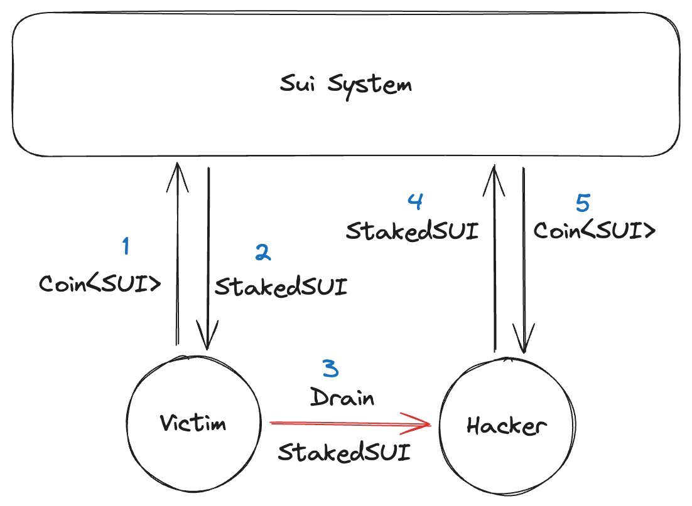

| SIP-Number          | 20 |
| ---:                | :--- |
| Title               | Native Stake |
| Description         | Adding the native stake function enhances user security |
| Author              | Pika <pika042@hotmail.com> |
| Editor              | Amogh Gupta <amogh@sui.io, @amogh-sui>  |
| Type                | Standard|
| Category            | Interface |
| Created             | 2024-04-24 |
| Comments-URI        | https://sips.sui.io/comments-20 |
| Status              | Withdrawn |
| Requires            | NA |


## Abstract

Encapsulate the new non-transferable `NativeStakedSui` object, along with corresponding function methods, to enhance the security of native stake users.

## Motivation

Since the adoption of SIP-6 proposal, the `StakedSui` object gained the `store` ability and became transferable. 
Currently, there are two types of staking methods on Sui: native stake and LST stake. 
While the transferable `StakedSui` brings convenience to LST, it also introduces risks to native stake users. The staking certificates `StakedSui`, originally only usable by staking users, may be stolen by hackers, leading to the loss of users' previously staked assets."

Moreover, such [attacks](https://twitter.com/pikapikasui/status/1783025361275765136) have occurred multiple times.

To safeguard users' staked assets from hackers, this SIP introduces a new non-transferable `NativeStakedSui` object to encapsulate `StakedSui`, which can be utilized in native stake scenarios, enhancing user security.

## Specification

Added encapsulation of the `StakedSui` object with the `NativeStakedSui` object, where `NativeStakedSui` only possesses the `key` capability and is non-transferable. 
Added corresponding `add` and `withdraw` functions for native stake.
- request_add_native_stake
- request_add_native_stake_non_entry
- request_withdraw_native_stake
- request_withdraw_native_stake_non_entry


### What Changed

The new code is located in the [sui_system.move](https://github.com/MystenLabs/sui/tree/main/crates/sui-framework/packages/sui-system/sources/sui_system.move) module.

Newly added data structure.

```rust
public struct NativeStakedSui has key {
    id: UID,
    staked_sui: StakedSui,
}
```

Newly added functions.

```rust
/// Add native stake to a validator's staking pool.
public entry fun request_add_native_stake(
    wrapper: &mut SuiSystemState,
    stake: Coin<SUI>,
    validator_address: address,
    ctx: &mut TxContext,
) {
    let staked_sui = request_add_stake_non_entry(wrapper, stake,validator_address, ctx);
    let native_staked_sui = NativeStakedSui {
        id: object::new(ctx),
        staked_sui,
    };
    transfer::transfer(native_staked_sui, ctx.sender());
}


/// Withdraw native stake from a validator's staking pool.
public entry fun request_withdraw_native_stake(
    wrapper: &mut SuiSystemState,
    native_staked_sui: NativeStakedSui,
    ctx: &mut TxContext,
) {
    let NativeStakedSui { id, staked_sui } = native_staked_sui;
    object::delete(id);
    let self = load_system_state_mut(wrapper);
    let withdrawn_stake = self.request_withdraw_stake(staked_sui, ctx);
    transfer::public_transfer(withdrawn_stake.into_coin(ctx), ctx.sender());
}

public fun staked_sui_borrow(native_staked_sui: &NativeStakedSui) {
    &native_staked_sui.staked_sui
}
```


## Rationale

After adding this portion of code, appropriate interfaces are provided for both native stake and LST stake scenarios.
For LST stake, the code remains unchanged, continuing to call stake-related functions and returning the `StakedSui` object.
For native stake users, they now call native stake-related functions, returning the non-transferable `NativeStakedSui` object. This also prevents the transfer of staked assets in the event of future hacker attacks.

## Backwards Compatibility

New data structures and function methods for native stake have been added. The original stake function remains callable, ensuring backward compatibility.

## Test Cases

```
REMOVE THIS BLOCK

This section is optional.

It is usually recommended to not include test cases when first submitting the SIP, and instead focus on the design and problem statement.
```

## Reference Implementation

[PR](https://github.com/MystenLabs/sui/pull/17317)

## Security Considerations

This SIP imposes more restrictions on the native stake scenario, helping to prevent users' staked assets from being stolen by hackers, thus enhancing user security experience.

## Copyright

[CC0 1.0](../LICENSE.md).
